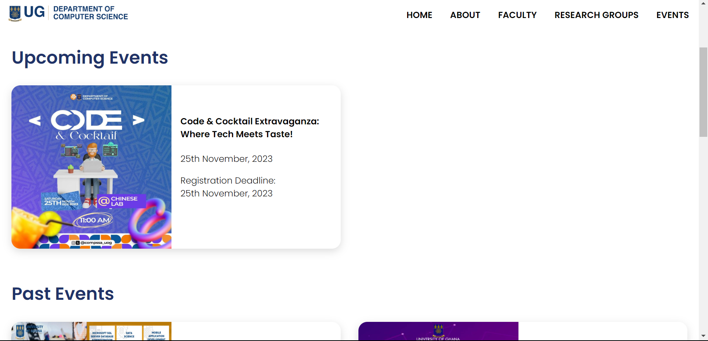

# DCIT_205_IA

- This Repo contains my work on a new website for the computer science department

## Unofficial Computer Science Department Website

## Introduction

This website is a project for my interim assesment. The purpose of this website is to showcase the Computer Science Department and its various aspects, such as the catalog, resources, events, contact information, and more. The website is designed to be user-friendly, navigable, responsive, and informative.

## Setup

To clone and set up this project, follow these steps:

1. Fork this repository to your own GitHub account.
2. Copy the URL of your forked repository.
3. Open your terminal and navigate to the directory where you want to clone the project.
4. Run the command  
```git clone <URL>```
where
`<URL>`
 is the URL of your forked repository.
5. Open the project folder in your code editor of choice.
6. To view the website, open the `index.html` file in your browser or use a **Live server** extension.
7. To view **live** version hosted by github pages visit
[Website Link](https://michaelperryjnr.github.io/11318179_DCIT205)

## What's New?

- Added a form to allow people sign up to the research groups
- Added a dynamic search for insight into every course in `phd.html`

## Author

- Name: Michael Perry Tettey
- Student ID: 11318179

## Screenshots

Here are some screenshots of the website pages:

- Header and Footer


- Home Page


- About Page


- Research Group


- Reseach group hero mobile


- Short Courses Page


- Events Page



- Undergraduate Page


- Dynamic Search on `phD.html`


## What I've Learnt

From this project, I have learnt:

- How to create a website using HTML, CSS, and JavaScript.
- How to use React to create reusable components and dynamic UI.
- How to apply responsive design principles to make the website accessible on different devices.
- How to use GitHub to fork, clone, commit, and create pull requests.
- How to research and use various computer science resources.

## Connect

[](https://t.me/michaelperryjnr)
[](https://twitter.com/michaelperryjnr)
[](https://www.linkedin.com/in/mptettey)
[](https://wa.me/233208860872?text=Hello%20Mike!%20I%27m%20coming%20from%20your%20Github%20profile)
